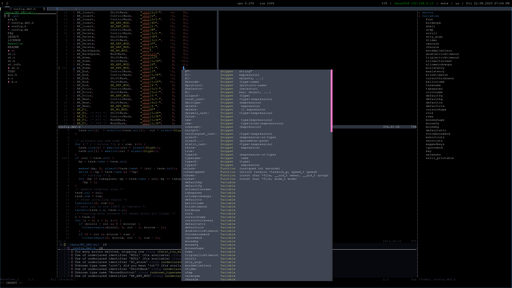

# Lomarco's Dotfiles

<p align="center">
  
</p>

<details open>
  <summary>Contents</summary>

- [Toolchain](#toolchain)
- [Gallery](#gallery)
- [Install Guide](#install-guide)
- [Sway Hotkeys](#sway-hotkeys)
- [NeoVim Config](#Neovim-config)
- [Repository Structure](#repository-structure)
  - [Base](#base)
    - [Sway](#sway)
    - [I3status](#i3status)
    - [Zsh](#zsh)
    - [Foot](#foot)
    - [NeoVim](#neovim)
    - [Tmux](#tmux)
    - [Vim](#vim)
    - [Git Config](#git-config)
  - [Scripts](#scripts)
    - [auto\_backup](#auto-backup)
    - [efistub-boot](#efistub-boot)
    - [testkernel](#testkernel)
    - [aupa](#aupa)
    - [crpt\_price](#crpt-price)
- [License](#license)

</details>

## Toolchain

<div align="center">

**Window Manager:** `Sway`

**Status Bar:** `Swaybar & I3status`

**Terminal:** `Foot`

**Shell:** `Zsh`

**Editor:** `NeoVim`

**Multiplexer:** `Tmux`

**Password Manager:** `Pass`

**WiFi Manager:** `Network Manager`

**File Manager:** `Yazi`

**Pdf Reader:** `Zathura`

**Bootloader:** `EFI Stub`

</div>

## Gallery

<p align="center">
  
  <br />
  
</p>

## Install Guide
Init and update submodules:
```bash
git submodule update --init --recursive
```

Update to latest changes:
```bash
git submodule update --remote
```

Install and select configs (home config for example. See `./deploy --help` for information):
```bash
./deploy home
```

## Sway Hotkeys

| Action                    | Shortcut            |
|---------------------------|---------------------|
| **Open terminal**         | `Super + Enter`     |
| **Launch browser**        | `Super + Shift + B` |
| **Launch launcher**       | `Super + D`         |
| **Launch zathura**        | `Super + Shift + Z` |
| **Take screenshot**       | `PrintScreen`       |
| **Take a part of screen** | `Super + C`         |
| **Kill window**           | `Super + Shift + Q` |
| **Exit sway**             | `Super + Shift + E` |
| **Reload sway config**    | `Super + Shift + C` |
| **Switch workspace**      | `Super + {1..0}`    |
| **Focus window**          | `Super + {H, J, K, L}` |
| **Fullscreen window**     | `Super + F`         |

Other hotkeys are available in the [sway config](home/.config/sway/config).

## NeoVim Config
Neovim config is a minimalistic, single-file configuration for programming in C, ASM, and C++, working with Git, and taking notes in Markdown. It includes essential plugins and sensible defaults for a smooth coding workflow.

#### Included Plugins and Modules
- lazy.nvim - plugin manager

- copilot.vim - AI code completion

- telescope.nvim - fuzzy finder for files, buffers, grep

- nvim-treesitter - syntax highlighting and indentation

- nvim-lspconfig - language server protocol support

- nvim-cmp - autocompletion framework

- mason.nvim and mason-lspconfig.nvim - LSP installer and manager

- gitsigns.nvim - git integration and signs

- Comment.nvim - easy code commenting

- mini.tabline - tabline for buffers

- autoclose.nvim - automatic closing of brackets and quotes

- tagbar - code structure sidebar

- oil.nvim - file explorer with git status

- zk-nvim - integration zk util with neovim

Color schemes like kanagawa.nvim and tokyonight.nvim

#### Basic Keybindings
```
<leader>h — toggle integrated terminal window

jk (insert mode) — quickly exit insert mode

Buffer navigation: gn (next), gp (previous), gw (close buffer), ge (open new empty buffer)

Completion navigation with <Tab> and <Shift-Tab> to select suggestions

LSP shortcuts:
    gd — go to definition

    gi — go to implementation

    K — show hover information

    <leader>ca — code actions

    <leader>r — rename symbol

    <leader>e — open diagnostics float

    [d and ]d — jump between diagnostics

    <leader>f — format file
```
## Repository Structure

### [packages\_list.md](packages_list.md) - List of all neaded packages for my system.

### Base

- [Sway](home/.config/sway/config)
- [I3status](home/.config/i3status/config)
- [Foot](home/.config/foot/foot.ini)
- [Zsh](home/.zshrc)
- [NeoVim](home/.config/nvim/init.lua)
- [Tmux](home/.config/tmux/tmux.conf)
- [Vim](home/.vimrc)
- [Git config](home/.gitconfig)

### Scripts

- [auto\_backup](bin/auto_backup)
- [efistub-boot](bin/efistub-boot)
- [testkernel](bin/testkernel)
- [aupa](bin/aupa)
- [crpt\_price](bin/crpt_price)

## License
Lomarco's Dotfiles is licensed under the Unlicense. See the [license](LICENSE) for details.
