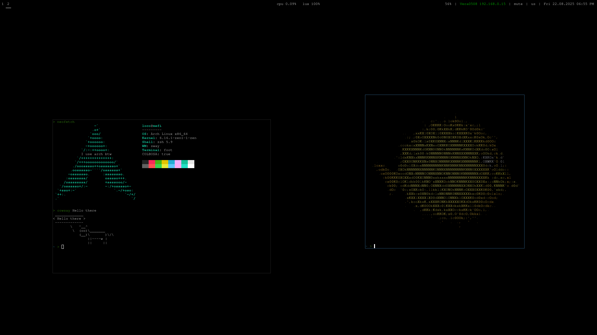
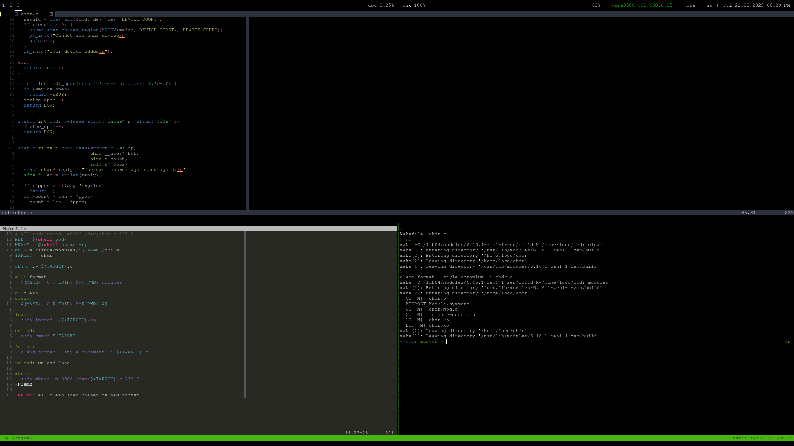

# Lomarco's Dotfiles

  

  
Contents

- [Toolchain](#toolchain)
- [Gallery](#gallery)
- [Repository Structure](#repository-structure)
  - [Base](#base)
    - [Sway](#sway)
    - [I3status](#i3status)
    - [Foot](#foot)
    - [Git Config](#git-config)
    - [NeoVim](#neovim)
    - [Tmux](#tmux)
    - [Vim](#vim)
    - [Zsh](#zsh)
  - [Extra](#extra)
    - [Fstab](#fstab)
    - [Pacman](#pacman)
    - [Iwd](#iwd)
    - [Mkinitcpio](#mkinitcpio)
    - [Paru](#paru)
    - [Kernel](#kernel)
    - [Makepkg](#makepkg)
  - [Scripts](#scripts)
    - [auto\_backup](#auto_backup)
    - [efistub-boot](#efistub-boot)
    - [testkernel](#testkernel)
    - [aupa](#aupa)
- [Sway Hotkeys](#sway-hotkeys)
- [License](#license)

---

## Toolchain

- **OS:** `Arch Linux`
- **Kernel:** `Linux zen`
- **Window Manager:** `Sway`
- **Status Bar:** `I3status`
- **Terminal:** `Foot`
- **Shell:** `Zsh + znap`
- **Editor:** `NeoVim`
- **Multiplexer:** `Tmux`
- **Notification Manager:** `Mako`
- **AUR Helper:** `Paru`
- **Password Manager:** `Pass`
- **Bootloader:** `EFI Stub`
- **WiFi Manager:** `Iwd`
- **File Manager:** `Lf`

---

## Gallery

  
   
  

---

## Repository Structure

### Base

- [Sway](base/config)
- [I3status](base/config_i3status)
- [Foot](base/foot.ini)
- [Git config](base/gitconfig)
- [NeoVim](base/init.lua)
- [Tmux](base/tmux.conf)
- [Vim](base/vimrc)
- [Zsh](base/zshrc)

### Extra

- [Fstab](extra/fstab)
- [Pacman](extra/pacman.conf)
- [Iwd](extra/main.conf)
- [Mkinitcpio](extra/mkinitcpio.conf)
- [Paru](extra/paru.conf)
- [Kernel](extra/kernel_config)
- [Makepkg](extra/makepkg.conf)

### Scripts

- [auto\_backup](scr/auto_backup)
- [efistub-boot](scr/efistub-boot)
- [testkernel](scr/testkernel)
- [aupa](scr/aupa)

---

## Sway Hotkeys

| Action                    | Shortcut             |
|---------------------------|---------------------|
| **Open terminal**         | `Super + Enter`     |
| **Launch browser**        | `Super + Shift + B` |
| **Launch launcher**       | `Super + D`         |
| **Take screenshot**       | `PrintScreen`       |
| **Kill window**           | `Super + Shift + Q` |
| **Exit sway**             | `Super + Shift + E` |
| **Reload sway config**    | `Super + Shift + C` |
| **Switch workspace**      | `Super + {1..0}`    |
| **Focus window**          | `Super + {H, J, K, L}` |
| **Fullscreen window**     | `Super + F`         |

Other hotkeys are available in the [sway config](config_files/config).

---
